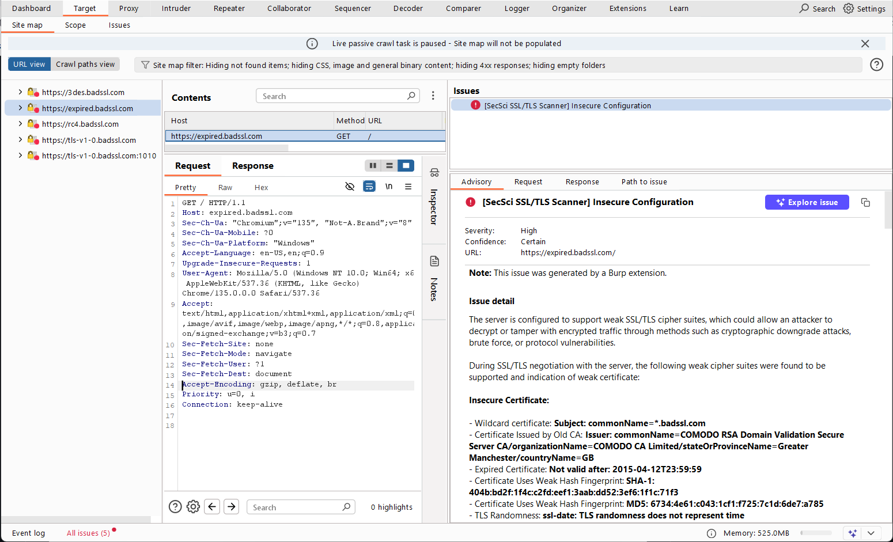
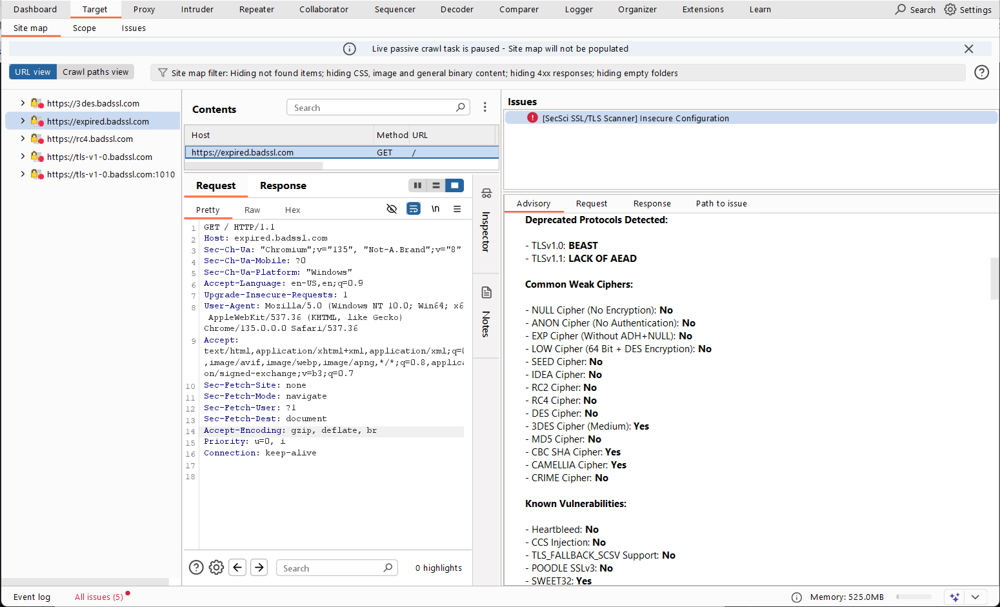

## 🛡️ SecSci SSL/TLS Scanner

This BurpSuite extension integrates `sslscan` and `nmap` SSL/TLS scanning directly into BurpSuite using Python.
It allows security testers to quickly identify SSL/TLS-related vulnerabilities like weak ciphers,
outdated protocols, and certificate issues from within the BurpSuite interface.


## Features

- Automatically scans HTTPS "In Scope" targets using `sslscan` and `nmap --script ssl*,tls*`.
- Displays results inside BurpSuite Issues.
- Integrates seamlessly with the Extender API.
- Auto-updates SSL/TLS issues from the repo.


## Prerequisites

Before installing the extension, ensure the following:

| Component       | Required | Notes                                                                                                           |
|-----------------|----------|-----------------------------------------------------------------------------------------------------------------|
| BurpSuite       | ✅        | [Professional version](https://portswigger.net/burp/documentation/desktop/getting-started/download-and-install) |
| Jython          | ✅        | [Download Jython](https://www.jython.org/download) (e.g., `jython-standalone-2.7.4.jar`)                        |
| Python (Jython) | ✅        | Must use Python 2.7 syntax                                                                                      |
| SSLScan         | ✅        | Ensure [`sslscan`](https://github.com/rbsec/sslscan/releases) is installed and added to PATH                                    |
| NMap            | ✅        | Ensure [`nmap`](https://nmap.org/download) is installed and added to PATH                                       |


## Installation Steps

### 1. Download the Jython Standalone JAR

1. Go to [https://www.jython.org/download](https://www.jython.org/download)
2. Download the **standalone jar** (e.g. `jython-standalone-2.7.4.jar`)
3. Save the file, e.g., `jython-standalone-2.7.4.jar`, to a known location.

### 2. Enable Python Support in BurpSuite

1. Open **BurpSuite**
2. Navigate to **Extender** → **Options**
3. Scroll to **Python Environment**
4. Click **Select file…**
5. Choose the download file (e.g., `jython-standalone-2.7.4.jar`)

### 3. Add the Extension

1. Download [ [zip](https://github.com/securityscience/SecSci-NMap-SSL-Scanner/zipball/main) | [tar](https://github.com/securityscience/SecSci-NMap-SSL-Scanner/tarball/main) ] NMAP SSL Scanner
   - Unzip or Untar the downloaded `SecSci-NMAP-SSL-Scanner.zip|.tar` file
2. Go to **Extender** → **Extensions**
3. Click **Add**
4. Set:
   - **Extension Type**: Python
   - **Extension File**: `ssl_tls_scanner.py`
5. Click **Next** → then **Finish**

If successful, the extension will show `Loaded` in the table.


## Usage Instructions

Once the extension is loaded in BurpSuite:

- Make sure the target host is marked **In Scope** in the **Target** tab.
- Visit an HTTPS page through **Proxy**, **Repeater**, or **Target**.
- The extension will:
  - Detect in-scope HTTPS responses
  - Automatically run:
    ```bash
     sslscan --no-colour <host>:<port>
    ```
    or
  
    ```bash
     nmap -sV --script ssl*,tls* -p <port> <host>
    ```
  - Look for known SSL/TLS weaknesses (e.g., SSLv2, SSLv3, RC4, null ciphers, heartbleed etc.) and indication of weak certificate.
  - Report issues directly to the **Target** tab → [target_host] → *Issues** pane with detailed output as custom findings

- Alternatively, SSL/TLS scan can be initiated by right clicking an HTTP *Request* or *Response* from **Proxy**, **Repeater**, or **Target** tab.
  - Right-click a request → choose **Extensions → SecSci SSL/TLS Scanner** to run SecSci SSL/TLS Scanner.
    

    **Console Output**
    


## Troubleshooting

| Issue                   | Solution                                                              |
|-------------------------|-----------------------------------------------------------------------|
| Extension fails to load | Make sure you’re using Python 2.7 syntax and Jython is set            |
| SSLScan not found       | Ensure `sslscan` is installed and in system's PATH                    |
| NMap not found          | Ensure `nmap` is installed and in system's PATH                       |
| No scan output shown    | Check **Extender → Output**, or use `print`/`callbacks.printOutput()` |


## **SSL/TLS Test Domains**

These subdomains are intentionally configured with specific SSL/TLS issues to aid in testing and validation:

### **Certificate Issues**

- `https://expired.badssl.com` – Expired certificate
- `https://self-signed.badssl.com` – Self-signed certificate
- `https://untrusted-root.badssl.com` – Untrusted root certificate
- `https://revoked.badssl.com` – Revoked certificate
- `https://pinning-test.badssl.com` – Certificate pinning

### **Protocol and Cipher Weaknesses**

- `https://tls-v1-0.badssl.com` – TLS 1.0 support
- `https://tls-v1-1.badssl.com` – TLS 1.1 support
- `https://3des.badssl.com` – 3DES cipher support
- `https://rc4.badssl.com` – RC4 cipher support
- `https://cbc.badssl.com` – CBC cipher support
- `https://dh480.badssl.com` – Weak Diffie-Hellman parameters

### **Other Test Cases**

- `https://mixed.badssl.com` – Mixed content (HTTP and HTTPS)
- `https://sha1-intermediate.badssl.com` – SHA-1 intermediate certificate
- `https://long-extended-subdomain-name-containing-many-letters-and-dashes.badssl.com` – Test for handling long subdomain names


## Integration with Sec-Sci AutoPT

These extension is designed to operate seamlessly as part of the [Sec-Sci AutoPT](https://www.security-science.com/sec-sci-autopt) automated penetration testing framework.


## License

[GNU GPL 3.0](LICENSE)


## Support

If encounter issues, bugs or want to request features:

- Submit an [Issue](https://github.com/securityscience/SecSci-SSL-TLS-Scanner/issues)
- Contact: [RnD@security-science.com](mailto:RnD@security-science.com)
- Or [https://www.security-science.com/contact](https://www.security-science.com/contact)


## Example Output

[ Click here](https://htmlpreview.github.io/?https://github.com/securityscience/SecSci-SSL-TLS-Scanner/blob/main/secsci_ssl_tls_scanner_report.html) to view sample exported report from BurpSuite.

### Example BurpSuite Issues





```
Starting Nmap 7.95 ( https://nmap.org ) at 2025-05-12 10:13 Eastern Daylight Time
Nmap scan report for expired.badssl.com (104.154.89.105)
Host is up (0.044s latency).
rDNS record for 104.154.89.105: 105.89.154.104.bc.googleusercontent.com

PORT    STATE SERVICE  VERSION
443/tcp open  ssl/http nginx 1.10.3 (Ubuntu)
| tls-nextprotoneg: 
|_  http/1.1
|_ssl-date: TLS randomness does not represent time
| ssl-cert: Subject: commonName=*.badssl.com
| Subject Alternative Name: DNS:*.badssl.com, DNS:badssl.com
| Issuer: commonName=COMODO RSA Domain Validation Secure Server CA/organizationName=COMODO CA Limited/stateOrProvinceName=Greater Manchester/countryName=GB
| Public Key type: rsa
| Public Key bits: 2048
| Signature Algorithm: sha256WithRSAEncryption
| Not valid before: 2015-04-09T00:00:00
| Not valid after:  2015-04-12T23:59:59
| MD5:   6734:4e61:c043:1cf1:f725:7c1d:6de7:a785
|_SHA-1: 404b:bd2f:1f4c:c2fd:eef1:3aab:dd52:3ef6:1f1c:71f3
|_http-server-header: nginx/1.10.3 (Ubuntu)
| ssl-enum-ciphers: 
|   TLSv1.0: 
|     ciphers: 
|       TLS_ECDHE_RSA_WITH_AES_128_CBC_SHA (secp256r1) - A
|       TLS_ECDHE_RSA_WITH_AES_256_CBC_SHA (secp256r1) - A
|       TLS_DHE_RSA_WITH_AES_128_CBC_SHA (dh 2048) - A
|       TLS_DHE_RSA_WITH_AES_256_CBC_SHA (dh 2048) - A
|       TLS_ECDHE_RSA_WITH_3DES_EDE_CBC_SHA (secp256r1) - C
|       TLS_RSA_WITH_AES_128_CBC_SHA (rsa 2048) - A
|       TLS_RSA_WITH_AES_256_CBC_SHA (rsa 2048) - A
|       TLS_RSA_WITH_3DES_EDE_CBC_SHA (rsa 2048) - C
|       TLS_DHE_RSA_WITH_CAMELLIA_256_CBC_SHA (dh 2048) - A
|       TLS_RSA_WITH_CAMELLIA_256_CBC_SHA (rsa 2048) - A
|       TLS_DHE_RSA_WITH_CAMELLIA_128_CBC_SHA (dh 2048) - A
|       TLS_RSA_WITH_CAMELLIA_128_CBC_SHA (rsa 2048) - A
|     compressors: 
|       NULL
|     cipher preference: server
|     warnings: 
|       64-bit block cipher 3DES vulnerable to SWEET32 attack
|   TLSv1.1: 
|     ciphers: 
|       TLS_ECDHE_RSA_WITH_AES_128_CBC_SHA (secp256r1) - A
|       TLS_ECDHE_RSA_WITH_AES_256_CBC_SHA (secp256r1) - A
|       TLS_DHE_RSA_WITH_AES_128_CBC_SHA (dh 2048) - A
|       TLS_DHE_RSA_WITH_AES_256_CBC_SHA (dh 2048) - A
|       TLS_ECDHE_RSA_WITH_3DES_EDE_CBC_SHA (secp256r1) - C
|       TLS_RSA_WITH_AES_128_CBC_SHA (rsa 2048) - A
|       TLS_RSA_WITH_AES_256_CBC_SHA (rsa 2048) - A
|       TLS_RSA_WITH_3DES_EDE_CBC_SHA (rsa 2048) - C
|       TLS_DHE_RSA_WITH_CAMELLIA_256_CBC_SHA (dh 2048) - A
|       TLS_RSA_WITH_CAMELLIA_256_CBC_SHA (rsa 2048) - A
|       TLS_DHE_RSA_WITH_CAMELLIA_128_CBC_SHA (dh 2048) - A
|       TLS_RSA_WITH_CAMELLIA_128_CBC_SHA (rsa 2048) - A
|     compressors: 
|       NULL
|     cipher preference: server
|     warnings: 
|       64-bit block cipher 3DES vulnerable to SWEET32 attack
|   TLSv1.2: 
|     ciphers: 
|       TLS_ECDHE_RSA_WITH_AES_128_GCM_SHA256 (secp256r1) - A
|       TLS_ECDHE_RSA_WITH_AES_256_GCM_SHA384 (secp256r1) - A
|       TLS_DHE_RSA_WITH_AES_128_GCM_SHA256 (dh 2048) - A
|       TLS_DHE_RSA_WITH_AES_256_GCM_SHA384 (dh 2048) - A
|       TLS_ECDHE_RSA_WITH_AES_128_CBC_SHA256 (secp256r1) - A
|       TLS_ECDHE_RSA_WITH_AES_128_CBC_SHA (secp256r1) - A
|       TLS_ECDHE_RSA_WITH_AES_256_CBC_SHA384 (secp256r1) - A
|       TLS_ECDHE_RSA_WITH_AES_256_CBC_SHA (secp256r1) - A
|       TLS_DHE_RSA_WITH_AES_128_CBC_SHA256 (dh 2048) - A
|       TLS_DHE_RSA_WITH_AES_128_CBC_SHA (dh 2048) - A
|       TLS_DHE_RSA_WITH_AES_256_CBC_SHA256 (dh 2048) - A
|       TLS_DHE_RSA_WITH_AES_256_CBC_SHA (dh 2048) - A
|       TLS_ECDHE_RSA_WITH_3DES_EDE_CBC_SHA (secp256r1) - C
|       TLS_RSA_WITH_AES_128_GCM_SHA256 (rsa 2048) - A
|       TLS_RSA_WITH_AES_256_GCM_SHA384 (rsa 2048) - A
|       TLS_RSA_WITH_AES_128_CBC_SHA256 (rsa 2048) - A
|       TLS_RSA_WITH_AES_256_CBC_SHA256 (rsa 2048) - A
|       TLS_RSA_WITH_AES_128_CBC_SHA (rsa 2048) - A
|       TLS_RSA_WITH_AES_256_CBC_SHA (rsa 2048) - A
|       TLS_RSA_WITH_3DES_EDE_CBC_SHA (rsa 2048) - C
|       TLS_DHE_RSA_WITH_CAMELLIA_256_CBC_SHA (dh 2048) - A
|       TLS_RSA_WITH_CAMELLIA_256_CBC_SHA (rsa 2048) - A
|       TLS_DHE_RSA_WITH_CAMELLIA_128_CBC_SHA (dh 2048) - A
|       TLS_RSA_WITH_CAMELLIA_128_CBC_SHA (rsa 2048) - A
|     compressors: 
|       NULL
|     cipher preference: server
|     warnings: 
|       64-bit block cipher 3DES vulnerable to SWEET32 attack
|_  least strength: C
| tls-alpn: 
|_  http/1.1
Service Info: OS: Linux; CPE: cpe:/o:linux:linux_kernel

Service detection performed. Please report any incorrect results at https://nmap.org/submit/ .
Nmap done: 1 IP address (1 host up) scanned in 32.55 seconds
```